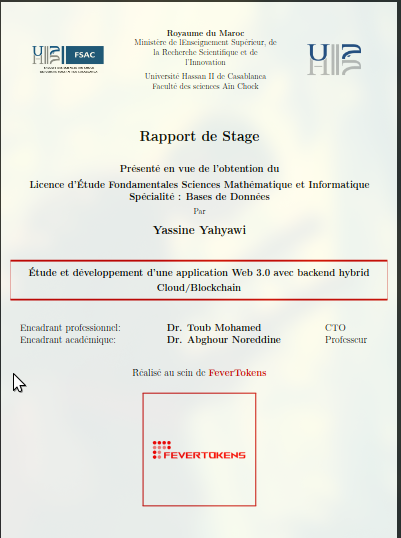

# Internship Report – Stage d'Entreprise

  

## Overview

This repository contains the LaTeX source files for my internship report.  
The report describes the tasks I performed during my 6-month internship and documents my learning experience.

## Compiling

You can compile the report using **VS Code with LaTeX Workshop** or directly on **Overleaf**.

## Notes

- The report focuses on internship tasks, not a specific project.

## Author

**Yassine Yahyawi**  
Bachelor of Computer Science – Internship 2024–2025
